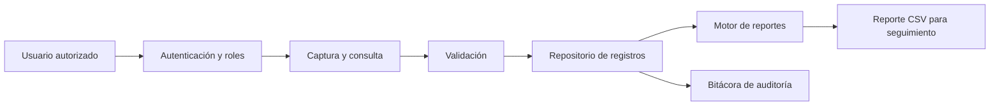

# SICORO - Sistema de Control de Información y Reportes Operativos

Prototipo académico desarrollado para la fase inicial de un proyecto integrador de Tecmilenio. El objetivo es centralizar registros operativos que anteriormente se concentraban de forma manual y generar reportes automáticos por área y estatus.

> **Privacidad:** el repositorio utiliza exclusivamente datos ficticios. No contiene información confidencial, nombres reales de colaboradores, datos personales, credenciales corporativas ni archivos internos de la organización.

## Organización de referencia

Empresa comercial de alcance nacional, identificada de forma genérica por confidencialidad. Área usuaria: operación y seguimiento de mantenimiento/taller automotriz.

La publicación del código y resultados requiere autorización por escrito de la organización y participación del área de Tecnologías de Información. En `docs/CARTA_AUTORIZACION.md` se incluye un formato para recabarla.

## Funcionalidades del prototipo

- Autenticación con contraseñas almacenadas mediante PBKDF2-HMAC-SHA256.
- Roles `ADMIN` y `CONSULTA`.
- Alta y consulta de registros operativos.
- Actualización de estatus.
- Filtros por área y estatus.
- Generación de reporte resumen en CSV.
- Bitácora local de accesos y operaciones.
- Validación básica de datos.

## Requisitos técnicos

- Java JDK 11 o superior.
- Windows, macOS o Linux.
- No requiere librerías externas ni conexión a internet.

## Ejecución

### Windows

1. Abra la carpeta del proyecto.
2. Ejecute `scripts\compilar_y_ejecutar.bat`.

### macOS o Linux

```bash
./scripts/compilar.sh
./scripts/ejecutar.sh
```

### Manual

```bash
mkdir out
javac -encoding UTF-8 -source 11 -target 11 -d out $(find src/main/java -name "*.java")
java -cp out mx.edu.tecmilenio.sicoro.Main
```

## Usuarios de demostración

| Usuario | Contraseña | Rol |
|---|---|---|
| `admin` | `Admin123!` | ADMIN |
| `consulta` | `Consulta123!` | CONSULTA |

Estas credenciales son únicamente para el prototipo académico y no deben reutilizarse en un entorno real.

## Estructura

```text
proyecto_integrador_sicoro/
├── data/                 Datos ficticios y usuarios demo
├── docs/                 Documento académico, diagramas y autorización
├── reportes/             Salida de reportes generados
├── scripts/              Scripts de compilación y ejecución
├── src/main/java/        Código fuente Java
├── .gitignore
├── LICENSE
└── README.md
```

## Flujo general



## Estado del proyecto

El prototipo cubre la fase de análisis de requerimientos y una prueba de concepto funcional. Para una implementación productiva se recomienda sustituir los archivos CSV por una base de datos administrada, integrar autenticación institucional, cifrado en tránsito, respaldos automáticos, monitoreo y pruebas de seguridad.

## Publicación en GitHub

Consulte `docs/GUIA_GIT_GITHUB.md`. Antes de hacer público el repositorio, verifique que la carta de autorización esté firmada y que el área de TI haya revisado el contenido.

## Licencia

MIT para fines académicos y de demostración, condicionada a que la organización haya autorizado la publicación de los elementos que le correspondan.
