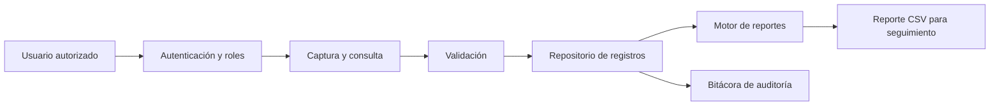

# SICORO - Sistema de Control de Información y Reportes Operativos

Prototipo desarrollado para la fase inicial de proyecto integrador de Tecmilenio. El objetivo es centralizar registros operativos que anteriormente se concentraban de forma manual y generar reportes automáticos por área y estatus.

> **Privacidad:** el repositorio utiliza exclusivamente datos ficticios. No contiene información confidencial, nombres reales de colaboradores, datos personales, credenciales corporativas ni archivos internos de la organización.
-
## Organización de referencia

Empresa comercial de alcance nacional, identificada de forma genérica por confidencialidad. Área usuaria: operación y seguimiento de mantenimiento/taller automotriz.

La publicación del código y resultados requiere autorización por escrito de la organización y participación del área de Tecnologías de Información. En `docs/CARTA_AUTORIZACION.md

## Funcionalidades del prototipo

- Autenticación con contraseñas almacenadas mediante PBKDF2-HMAC-SHA256.
- Roles `ADMIN` y `CONSULTA`.
- Alta y consulta de registros operativos.
- Actualización de estatus.
- Filtros por área y estatus.
- Generación de reporte resumen en CSV.
- Bitácora local de accesos y operaciones.
- Validación básica de datos.

## Requisitos técnicos

- Java JDK 11 o superior.
- Windows, macOS o Linux.
- No requiere librerías externas ni conexión a internet.


## Usuarios de demostración

| Usuario | Contraseña | Rol |
|---|---|---|
| `admin` | `Admin123!` | ADMIN |
| `consulta` | `Consulta123!` | CONSULTA |


## Estructura

```text
proyecto_integrador_sicoro/
├── data/                 Datos ficticios y usuarios demo
├── docs/                 Documento académico, diagramas y autorización
├── reportes/             Salida de reportes generados
├── scripts/              Scripts de compilación y ejecución
├── src/main/java/        Código fuente Java
├── .gitignore
├── LICENSE
└── README.md
```

## Flujo general



## Estado del proyecto

El prototipo cubre la fase de análisis de requerimientos y una prueba de concepto funcional. 


## Administración del desarrollo

Organicé el trabajo con las ramas principales `develop` y `master`. Para cada funcionalidad utilizo una rama independiente y posteriormente integro los cambios a `develop` mediante un pull request.

También conecté el proyecto con Zube para administrar issues, prioridades, estimaciones y milestones. Las etapas definidas son `Beta` y `General Availability (GA)`.

## Integración continua

Configuré Maven, Travis CI y una prueba JUnit para validar la generación del reporte CSV. El comando de prueba es:

```bash
mvn clean test
```

El diagrama y la descripción de los componentes se encuentran en [`docs/ARQUITECTURA.md`](docs/ARQUITECTURA.md).
