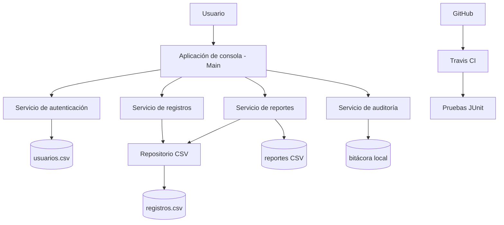

# SICORO - Sistema de Control de Información y Reportes Operativos

Desarrollé SICORO como un prototipo académico en Java 11 para centralizar registros operativos, dar seguimiento a la información y generar reportes automáticos por área y estatus.

> **Privacidad:** utilizo exclusivamente datos ficticios. El repositorio no contiene información confidencial, credenciales corporativas, datos personales ni archivos internos de la organización.

## Tabla de contenidos

1. [Resumen ejecutivo](#resumen-ejecutivo)
2. [Arquitectura](#arquitectura)
3. [Requerimientos](#requerimientos)
4. [Instalación](#instalación)
5. [Pruebas](#pruebas)
6. [Implementación](#implementación)
7. [Configuración](#configuración)
8. [Uso](#uso)
9. [Contribución](#contribución)
10. [Roadmap](#roadmap)
11. [Producto](#producto)
12. [Documentación adicional](#documentación-adicional)
13. [Licencia](#licencia)

---

## Resumen ejecutivo

### Descripción

Desarrollé SICORO como una prueba de concepto para facilitar el registro, consulta, seguimiento y generación de reportes de información operativa. La versión actual funciona localmente mediante una interfaz de consola y utiliza archivos CSV para conservar datos ficticios entre ejecuciones.

### Problema identificado

Identifiqué que la información necesaria para elaborar reportes puede encontrarse dispersa y requerir actividades manuales de concentración y seguimiento. Esto incrementa el tiempo de preparación, dificulta la trazabilidad y aumenta la posibilidad de errores durante la consolidación de información.

### Solución

Con SICORO implementé las siguientes funciones:

- Autenticación de usuarios de demostración.
- Separación de permisos mediante los roles `ADMIN` y `CONSULTA`.
- Registro de información operativa.
- Consulta y filtrado de registros.
- Actualización de estatus.
- Persistencia local mediante archivos CSV.
- Generación de reportes automáticos en CSV.
- Cálculo de totales por área, estatus y porcentaje de cierre.
- Registro de accesos y operaciones en una bitácora local.

El prototipo no se conecta con sistemas productivos ni utiliza información real de la organización.

---

## Arquitectura

Diseñé SICORO como una aplicación Java de consola organizada por capas. Separé la interacción con el usuario, los servicios, el acceso a datos y la generación de archivos.



En la versión Beta no utilizo servidor web, servidor de aplicaciones ni base de datos independiente. Considero estos componentes como parte de una evolución futura hacia una versión RC/GA.

La descripción ampliada de la arquitectura se encuentra en [`docs/ARQUITECTURA.md`](docs/ARQUITECTURA.md).

---

## Requerimientos

### Requerimientos de infraestructura

| Componente | Requerimiento actual |
|---|---|
| Servidor de aplicación | No lo requiero en la versión Beta |
| Servidor web | No lo requiero en la versión Beta |
| Base de datos | No la requiero; utilizo persistencia local mediante CSV |
| Sistema operativo | Windows, macOS o Linux |
| Java | JDK 11 o superior |
| Maven | 3.6 o superior |
| Git | Lo utilizo para clonar y administrar el repositorio |
| Conexión a internet | La utilizo para clonar el repositorio y descargar dependencias Maven |

### Paquetes adicionales

Utilizo las bibliotecas estándar de Java y las siguientes dependencias de desarrollo:

- JUnit Jupiter 5.10.2 para las pruebas automatizadas.
- Maven Surefire Plugin 3.2.5 para ejecutar las pruebas.
- Maven JAR Plugin para generar el archivo ejecutable.

Definí estas dependencias en `pom.xml`, por lo que Maven las descarga automáticamente.

### Verificación del ambiente

Para comprobar las versiones instaladas utilizo:

```bash
java -version
mvn -version
git --version
```

---

## Instalación

### 1. Clono el repositorio

```bash
git clone https://github.com/marianabernalv369/sicoro-proyecto-integrador.git
cd sicoro-proyecto-integrador
```

### 2. Selecciono la rama estable

```bash
git checkout master
```

### 3. Compilo el proyecto con Maven

```bash
mvn clean package
```

Al finalizar obtengo el archivo ejecutable en:

```text
target/SICORO-1.0.jar
```

### 4. Ejecuto la aplicación

Desde la raíz del repositorio utilizo:

```bash
java -jar target/SICORO-1.0.jar
```

También incluí scripts de apoyo para simplificar la ejecución.

**macOS o Linux**

```bash
./scripts/compilar.sh
./scripts/ejecutar.sh
```

**Windows**

```text
scripts\compilar_y_ejecutar.bat
```

---

## Pruebas

### Pruebas automatizadas

Para ejecutar las pruebas JUnit utilizo:

```bash
mvn clean test
```

En `ReporteServiceTest` utilizo registros ficticios para validar la generación del reporte, incluyendo encabezados, totales por área y porcentaje de cierre.

### Prueba manual

Para comprobar el funcionamiento de forma manual sigo este flujo:

1. Inicio SICORO.
2. Inicio sesión con un usuario de demostración.
3. Consulto los registros existentes.
4. Inicio sesión como administrador para registrar o modificar información.
5. Genero un reporte automático.
6. Compruebo que el archivo se haya creado dentro de `reportes/`.

---

## Implementación

### Ambiente local

La versión actual está diseñada para ejecutarse localmente. Para utilizarla en otro equipo preparo el ambiente con JDK 11 o superior, clono el repositorio, compilo el proyecto, ejecuto las pruebas y finalmente inicio la aplicación con el JAR generado.

Los comandos principales que utilizo son:

```bash
mvn clean package
mvn clean test
java -jar target/SICORO-1.0.jar
```

### Nube / producción

En la versión Beta no despliego SICORO en Heroku ni en otro proveedor de nube porque actualmente funciona como una aplicación de consola con persistencia CSV local. Para una versión productiva considero incorporar una interfaz web, una base de datos, manejo seguro de credenciales, respaldos y una plataforma de despliegue.

---

## Configuración

### Estructura principal

```text
Repositorio_SICORO_Git/
├── data/                  Datos ficticios y usuarios demo
├── docs/                  Arquitectura, manuales y documentación
├── producto/              JAR ejecutable de entrega
├── reportes/              Reportes CSV generados
├── scripts/               Scripts de compilación y ejecución
├── src/main/java/         Código fuente
├── src/test/java/         Pruebas JUnit
├── .gitignore
├── .travis.yml
├── LICENSE
├── pom.xml
└── README.md
```

### Archivos de configuración

- `pom.xml`: aquí definí la versión de Java, dependencias, pruebas y generación del JAR.
- `.travis.yml`: aquí configuré la integración continua.
- `.gitignore`: aquí excluí archivos generados, temporales y secretos locales.
- `data/usuarios.csv`: contiene usuarios ficticios de demostración.
- `data/registros.csv`: contiene los registros ficticios utilizados por el prototipo.

### Seguridad

Para la seguridad del prototipo incorporé:

- PBKDF2-HMAC-SHA256 para derivación de contraseñas.
- Roles `ADMIN` y `CONSULTA`.
- Límite de intentos de acceso.
- Bitácora local de operaciones.
- Exclusión de secretos mediante `.gitignore`.

Mantengo fuera del repositorio contraseñas reales, tokens, llaves, datos personales e información corporativa.

---

## Uso

### Usuario final - rol CONSULTA

Utilizo las siguientes credenciales ficticias para demostrar el rol de consulta:

| Usuario | Contraseña | Rol |
|---|---|---|
| `consulta` | `Consulta123!` | CONSULTA |

Con este rol puedo:

- Consultar registros.
- Filtrar información por área o estatus.
- Salir de la aplicación.

No puedo registrar información, modificar estatus ni generar reportes administrativos.

### Usuario administrador - rol ADMIN

Utilizo las siguientes credenciales ficticias para demostrar el rol administrador:

| Usuario | Contraseña | Rol |
|---|---|---|
| `admin` | `Admin123!` | ADMIN |

Con este rol puedo:

1. Consultar registros.
2. Registrar información.
3. Actualizar el estatus de un registro.
4. Filtrar registros.
5. Generar un reporte automático.
6. Finalizar la sesión.

El manual completo se encuentra en [`docs/MANUAL_USUARIO.md`](docs/MANUAL_USUARIO.md).

---

## Contribución

Para mantener un historial ordenado utilizo `develop` como rama de integración y `master` como rama estable.

### 1. Clono el repositorio

```bash
git clone https://github.com/marianabernalv369/sicoro-proyecto-integrador.git
cd sicoro-proyecto-integrador
```

### 2. Actualizo develop

```bash
git checkout develop
git pull origin develop
```

### 3. Creo una rama nueva

```bash
git checkout -b feature/nombre-de-la-funcionalidad
```

### 4. Realizo los cambios y las pruebas

```bash
mvn clean test
git status
git add .
git commit -m "feat: describir cambio realizado"
```

### 5. Envío la rama a GitHub

```bash
git push -u origin feature/nombre-de-la-funcionalidad
```

### 6. Creo el Pull Request

En GitHub abro un Pull Request desde la rama `feature/*` hacia `develop` y describo el cambio realizado.

### 7. Espero la revisión

Antes del merge reviso los cambios, las pruebas y posibles conflictos. Si encuentro alguna observación, la corrijo en la misma rama y actualizo el Pull Request.

### 8. Realizo el merge

Cuando el cambio está aprobado realizo el merge hacia `develop`. Posteriormente, cuando considero estable el conjunto de cambios, integro `develop` a `master`.

La guía ampliada se encuentra en [`docs/CONTRIBUCION.md`](docs/CONTRIBUCION.md).

---

## Roadmap

Para las siguientes etapas considero los siguientes requerimientos:

- Migrar la persistencia CSV a una base de datos.
- Desarrollar una interfaz web con HTTPS.
- Implementar respaldos automáticos y recuperación.
- Mejorar la administración de usuarios y permisos.
- Preparar la configuración para despliegue en servidor o nube.
- Incrementar la cobertura de pruebas automatizadas.
- Incorporar métricas y visualizaciones adicionales.

La evolución que planteo es:

```text
Beta local
   ↓
Validación y pruebas
   ↓
RC / General Availability
   ↓
Base de datos + interfaz web + respaldos
   ↓
Despliegue productivo
```

---

## Producto

### Archivo ejecutable

Como SICORO no está implementado en la nube, incluyo el archivo JAR ejecutable en:

```text
producto/SICORO-1.0.jar
```

También puedo generarlo nuevamente con:

```bash
mvn clean package
```

### Video de demostración

Para completar la evidencia presentaré un video de demostración en el que mostraré el repositorio, la ejecución del sistema, el acceso con ambos roles, la consulta y actualización de registros, la generación del reporte CSV y las pruebas automatizadas.

---

## Documentación adicional

- [Arquitectura](docs/ARQUITECTURA.md)
- [Manual de usuario y administrador](docs/MANUAL_USUARIO.md)
- [Guía de contribución](docs/CONTRIBUCION.md)
- [Carta de autorización](docs/CARTA_AUTORIZACION.md)

---

## Licencia

Desarrollé este proyecto con fines académicos y utilizo la licencia MIT incluida en `LICENSE`.
