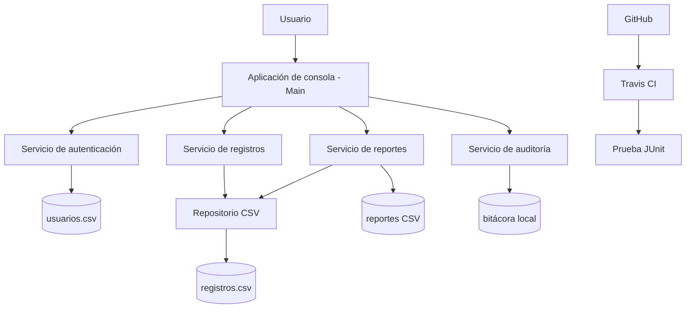

# Arquitectura de la solución SICORO

Diseñé SICORO como una aplicación Java de consola organizada por capas. Esta estructura separa la interacción con el usuario, las reglas de negocio, el acceso a datos y la generación de archivos.

## Componentes

| Componente | Responsabilidad |
|---|---|
| Aplicación de consola | Presentar el menú y coordinar las acciones del usuario. |
| Servicios | Aplicar autenticación, validaciones, consulta, actualización, reportes y auditoría. |
| Repositorio CSV | Leer y guardar registros ficticios de forma local. |
| Archivos de salida | Conservar reportes y bitácoras generados por el prototipo. |
| GitHub y Travis CI | Administrar versiones y ejecutar automáticamente la prueba JUnit. |

En esta versión no utilizo servidores web ni bases de datos corporativas, porque el alcance corresponde a una prueba de concepto académica local.
